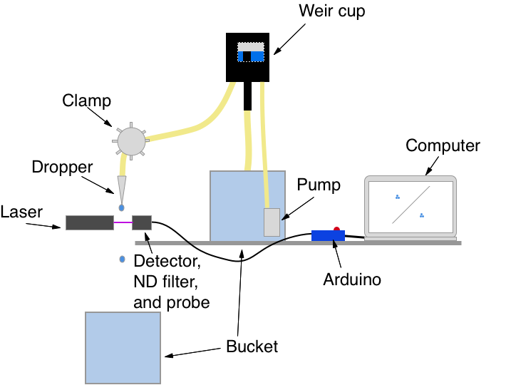
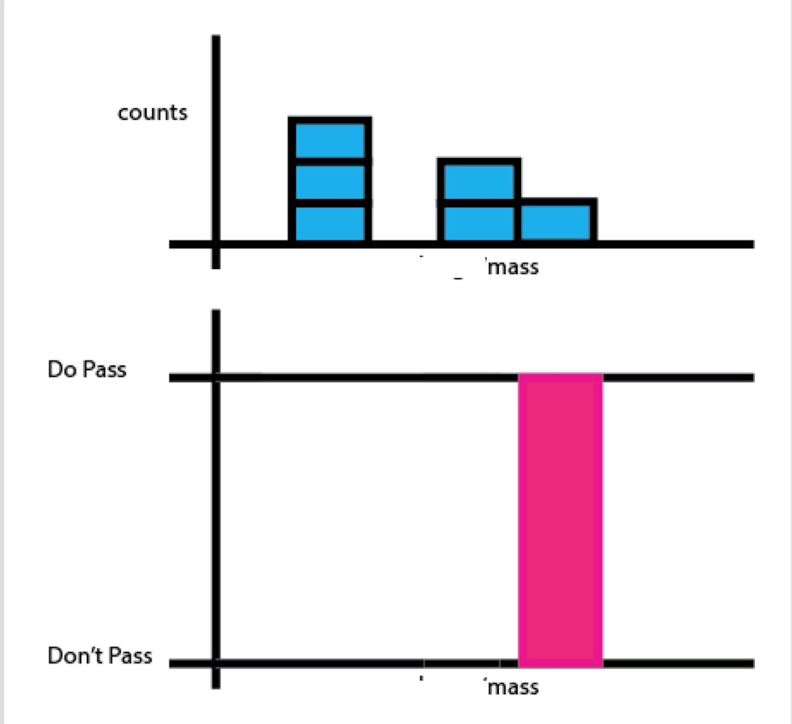
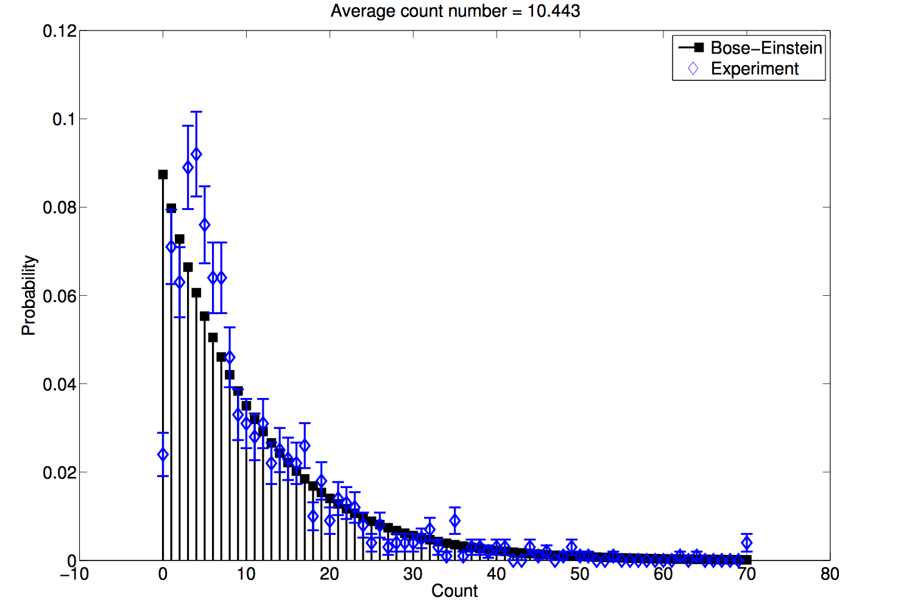
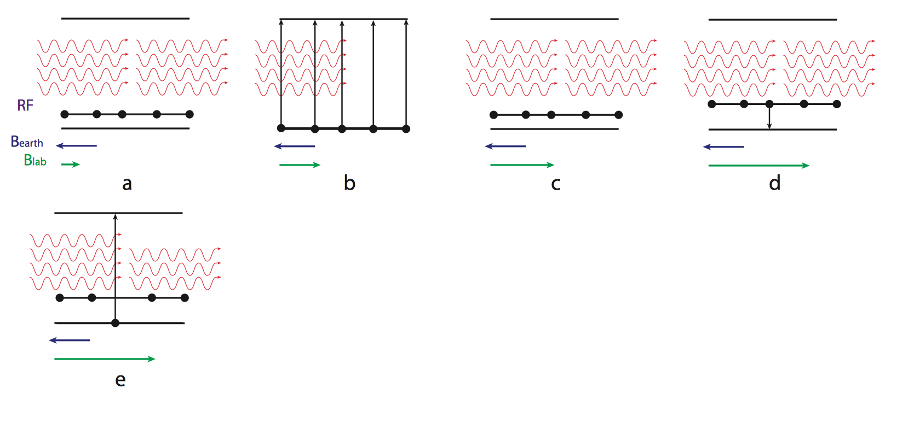

# Physics Projects
In 2016 I graduated from California Polytechnic University with a degree in Physics.

You can find links to my favorite projects below.

### Physics skills

* Create graphs to represent data
* Analyze experimental data and theoretical laws
* Write rich lab reports with LaTeX
* Write Matlab code
* Program Arduino
* Perform statistical analysis with Excel

### Links to projects
#### [Periodic, Period Doubling, and Chaotic Dripping in a LeakyFaucet:](https://github.com/mbigras/physics_projects/blob/master/senior_project/report/main.pdf)

#### [Residual Gas Analyzer Presentation Slides:](https://github.com/mbigras/physics_projects/blob/master/qlab2_final_presentation.pptx)

#### [Statistical Analysis of Photon Emissions:](https://github.com/mbigras/physics_projects/blob/master/photon_counting_report/lab_report.pdf)

#### [Optical Pumping of Rubidium:](https://github.com/mbigras/physics_projects/blob/master/optical_pumping_report/lab_report.pdf)

